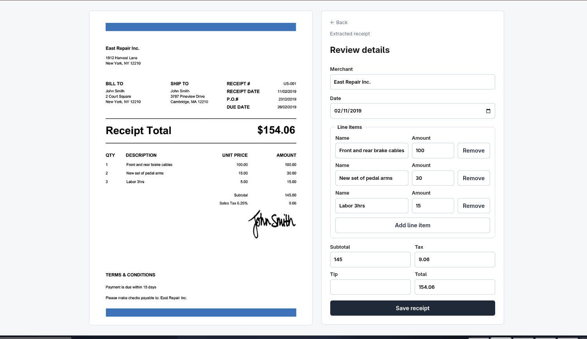
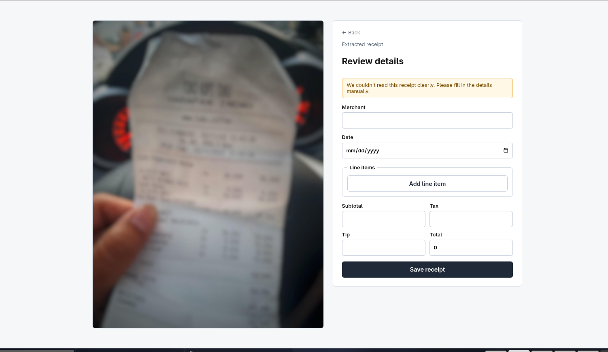

# Receipt Parser

## What did you build?

I created a web application where anyone could take a picture of a receipt, send it to Gemini, and it shows us the extracted data in the form next to the original image. In such a way, We have an opportunity to look through the extracted data and make corrections in terms of the name of the shop, the date of purchase, the list of items purchased, and their price totals. Another useful function is that the program checks if the total price of the list corresponds to the total amount of the purchase. It makes the verification process more comfortable since we know what we should look through specifically.

## What are the biggest tradeoffs you made, and why?

**1. Mismatch detection via deterministic math, not model-reported confidence.**
Initially, the thought was to get Gemini to report back a confidence value for each field and then flag the fields which had low confidence. This approach was dismissed for the reason that there could be an issue with self-reported confidence by the model. Just like the self-reported confidence, the error in self-reported confidence might also be wrong. The flagging for mismatch is done server-side and is based on arithmetic (line item total plus tax total versus total).

**2. The mismatch formula had to be revised after real testing exposed a false positive.**
In my initial implementation, I was comparing total to only `lineItems + tax`, intentionally omitting the `tip` because the tip was thought to be decided after printing the receipt. It did not take long to realize that this was incorrect and the `tip` was included in the `total`. The total needed to be compared against both totals without the tip and with the tip for the receipt to be considered a correct receipt. I think it would be more beneficial to deliver a decision that was refined through a real-world test case than to just deliver a seemingly perfect decision.

**3. Line items are scoped to purchased products/services only — tax, tip, subtotal, and discounts are separate top-level fields, and discounts are out of scope entirely.**
The receipt itself has genuinely diverse lines—what was bought and how it all adds up—and it wouldn't have been simpler or more intuitive to represent those items as a flattened out list; it would have simply complicated the model and correction interface without adding anything. I decided to simply leave out discounts completely because they're not emphasized in the specification and partial support is worse than none at all.
## Where did you use an LLM, and for what?

- **Gemini Flash (`gemini-flash-latest`)** is the extraction engine inside the product itself — sent the uploaded receipt image directly (no OCR step), returns structured JSON per a fixed prompt/schema. Chosen over Flash-Lite because for this product, a bad extraction directly burdens the correction UI the user has to work through, so I optimized for accuracy over the marginal cost/latency savings of the lighter model.
- **[your answer — which coding tools you used, for what specifically]**

## What would you do with another week?

- Handle discounts explicitly instead of ignoring them.
- Add a lightweight OCR/second-pass fallback (or model escalation) specifically for the low-confidence/blurry-image case, rather than just surfacing a "couldn't read this clearly" message.
- Have a list view showing previous receipts saved by a user. /api/receipts endpoint already exists, it just needs a front-end.

- Basic tests around the mismatch calculation and the retry logic, since those are the two places a silent regression would actually matter.
- Client-side file-type/size validation as a UX nicety on top of the existing server-side enforcement.

## What's one thing in this spec you'd push back on if I were your PM?

Two related ways to improve the product over time.

The first way is that the spec treats correction as the fundamental interaction—"the human catches what the LLM gets wrong"—but there is not even any requirement to store the correction in the product. Currently, as soon as the user saves the correction, both the output of the original AI generation and the diff that shows what was changed are gone. In a product, the diff would be the single most valuable piece of information: the only indicator that lets you know which fields have issues, how frequently, and whether the prompts worked. The one part of the system that learns from mistakes has no record of them.

The second is that the spec asks about "how do you handle low-confidence extractions?" as if field-level confidence is somehow produced by the model. Gemini produces structured JSON output without any confidence measure attached to fields. What I implemented—a very naive arithmetic diff against the expected value—is not actually the confidence measure but a proxy for it.
## Setup

```
GEMINI_API_KEY=your-key-here
```
Copy `.env.example` to `.env` and fill in your key. Run `npm run dev` from the project root.

**Known gaps (by design, not oversight):** discounts aren't extracted or modeled; only JPG/PNG are accepted (no HEIC); no authentication or deployment config, per spec.

## Screenshots

**Successful extraction:**


**Low-confidence extraction (blurry photo):**

